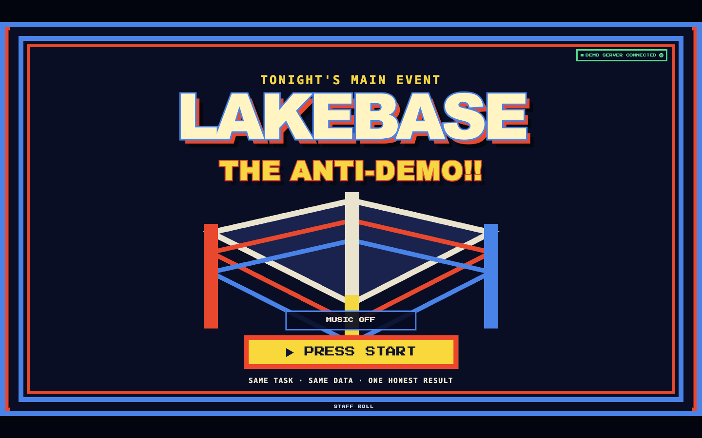
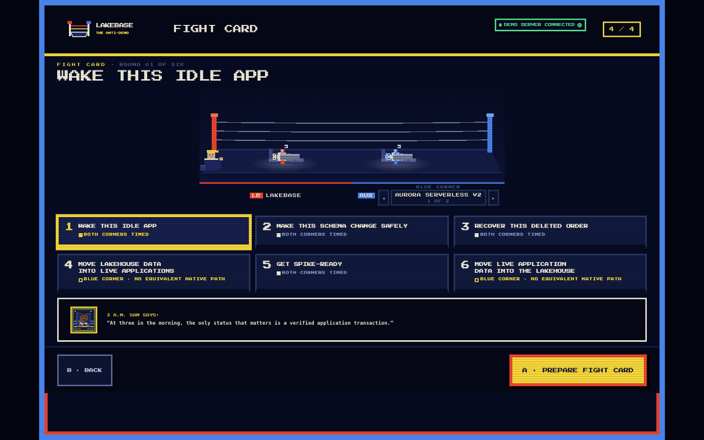
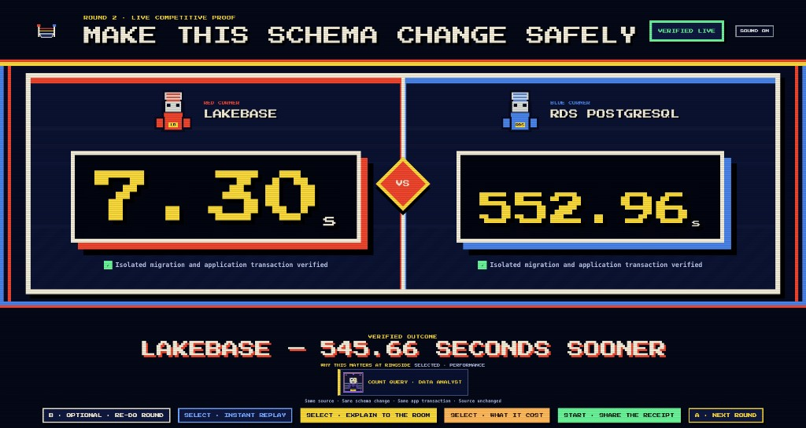

# Lakebase: The Anti-Demo

Lakebase: The Anti-Demo is a live, six-round database fight. You can put
[Databricks Lakebase](https://docs.databricks.com/aws/en/oltp/) up against
Aurora Serverless v2 or RDS PostgreSQL today. More competitors are being added.

The app provisions real databases in your accounts, runs the same task through
the same verifier, and shows the result in an 8-bit boxing ring. A failed lane
stays failed on screen.







## Install

> [!WARNING]
> Installation creates billable cloud resources and public database endpoints.
> Read [Cost and safety](#cost-and-safety) before running `--apply`.

You need:

- Python 3.12 or newer, `uv`, Node.js, `npm`, Terraform 1.9 or newer, the AWS
  CLI, the Databricks CLI, `psql`, and `jq`
- An AWS Databricks workspace with Lakebase enabled
- A Databricks service principal with OAuth M2M credentials
- A SQL warehouse and a Unity Catalog you can create schemas in
- An AWS account with permission to create RDS, Aurora, EC2, IAM, KMS grants,
  and Secrets Manager entries, in a region that still has its default VPC —
  the demo discovers that network and cannot be given another one

Copy the environment template:

```bash
cp docs/bootstrap.env.example .env.bootstrap
```

Fill in these five values:

```dotenv
DATABRICKS_HOST=
DATABRICKS_CLIENT_ID=
DATABRICKS_CLIENT_SECRET=
AWS_ACCESS_KEY_ID=
AWS_SECRET_ACCESS_KEY=
```

Check your machine and accounts. This command does not provision cloud
resources:

```bash
./bootstrap.sh
```

Provision the demo:

```bash
./bootstrap.sh --apply
```

The installer prints the expected cost and waits for you to type `PROVISION`.

Start the local app. `--apply` must have finished first: it is what provisions
`.venv`, which `./antidemo` refuses to run without, and `frontend/dist`, which
the UI answers 503 without. Neither is committed.

Ask for the derived environment on its own before you use it:

```bash
./bootstrap.sh --print-env
```

Export lines on stdout mean it worked, and then this is the launch:

```bash
eval "$(./bootstrap.sh --print-env)"
./antidemo serve
```

**No output means the `eval` does nothing and says nothing.** It evaluates an
empty string, sets no variable and reports no error, and `./antidemo serve` then
stops on a missing `ANTI_DEMO_MANIFEST` and recommends the command that just
failed. `--print-env` re-runs the whole preflight and prints its exports last,
so anything wrong with the account it checks — a credential that cannot read
the account, a region with no default VPC — suppresses all of them, whether or
not the installation it would have pointed at is fine.

Serving needs one variable out of it. Set that directly instead, from the
highest-numbered generation directory on disk:

```bash
export ANTI_DEMO_MANIFEST="$PWD/$(ls -d .anti-demo-v*/ | sort -V | tail -1)manifest.json"
unset AWS_PROFILE AWS_DEFAULT_PROFILE
./antidemo serve
```

`sort -V` is doing real work there: generations must be compared as numbers,
because `.anti-demo-v10` sorts *before* `.anti-demo-v7` as text. The `unset`
mirrors what `--print-env` emits — this installation authenticates from the two
AWS keys, and a named profile alongside them is refused rather than ignored.

Open [http://127.0.0.1:8000](http://127.0.0.1:8000).

To deploy it as a Databricks App, use this provisioning command instead:

```bash
./bootstrap.sh --apply --deploy-app
```

For setup options and troubleshooting, see
[docs/BOOTSTRAP.md](docs/BOOTSTRAP.md).

## The six rounds

| Round | Task | What happens |
| --- | --- | --- |
| 1 | Wake an idle app | Lakebase and Aurora are verified at scale zero. RDS cannot pause, so it is not timed. |
| 2 | Change a schema safely | Lakebase branches, Aurora clones, and RDS restores to a point in time. |
| 3 | Recover a deleted order | Each lane restores and reads the same row. |
| 4 | Move lakehouse data into an app | Delta data moves through managed reverse ETL into Lakebase. |
| 5 | Get ready for a connection spike | Lakebase uses its pooled host. The AWS lane creates and tests an RDS Proxy. |
| 6 | Move app data into the lakehouse | A committed Lakebase row moves through change data capture into Delta. |

Rounds 1, 2, 3, and 5 compare 2 lanes. Rounds 4 and 6 run only on Lakebase
because the matching AWS integration stacks are not built or timed. They make no
AWS performance claim.

[ROUNDS.md](ROUNDS.md) defines the timing and fairness rules for every round.

## Cost and safety

Nothing here expires on its own. Three separate things bill, they stop at three
different times, and only the first of them is a cost you pay simply for having
this installed. Read the middle column before the number. These rates came from
one installation in `us-west-2`:

| What bills | When it bills | Approximate rate |
| --- | --- | ---: |
| AWS databases, runner, storage, addresses, and secrets | From `--apply` until `cleanup`, whether or not anyone runs a round | **~$8.36/day** |
| Databricks App compute | Only if you deployed the App, and then until you stop it — a running App bills for its provisioned capacity even with nobody on it | **~$10.93/day** |
| Round 4 reverse-ETL pipeline | Only while it is actually up. Round 4 starts it at arm and stops it 20 minutes after the bout settles. Both figures beside this are measured, not projected | **~$0.61/hour**, and **~$0.32** for one bout |

**What you pay by default.** A local install is about `$8.36/day`. Deploy the App
as well and it is about `$19.29/day`. Round 4 adds cents rather than dollars when
its stop fires: one bout costs about `$0.32` end to end, and a longer
32.85-minute warm window came to `$0.50` once its posted usage had settled. Clone
it on Friday and forget it until Monday and that is about `$25`, or about `$58`
with the App deployed.

Left up for a full day the pipeline would take the installation subtotal to about
`$22.93/day`, of which `$14.57` is the Round 4 pipeline's rate while it is up;
the subtotal drops to about `$8.36/day` with that pipeline stopped. Databricks
App compute, about `$10.93/day`, is disclosed on its own line because it bills
whether or not this project exists. The all-in figure is about `$33.86/day` while
the pipeline runs, or `$19.29/day` with the pipeline stopped. `$22.93` and
`$19.29` are two different quantities `$3.64` apart: the first is the
installation subtotal with the pipeline running; the second includes App compute
with the pipeline stopped.

Every standing figure here traces to one sealed receipt: receipt `EECDD4D6`,
captured on 2026-08-25. **The Round 4 pipeline rate is the one exception, and it
no longer reconciles to that receipt.** The receipt reached `$11.07/day` for that
line by dividing its posted DBU by the span from its first posted interval to its
last, and that span contained every hour the pipeline was stopped — it sampled a
62.5% duty cycle, so idle time sat in the denominator. That yields a
duty-cycle-blended average, which is not the quantity the row above promises. The
`$0.61/hour` published here is measured over 53.5 contiguous hours of uptime and
corroborated by a second clean window; `$0.32` a bout is posted usage over
complete bout windows. Databricks costs use posted usage and posted prices.
Public rate cards supply the AWS estimate; no invoice has ever confirmed it. Your
bill will vary by region and usage. [docs/PRICING.md](docs/PRICING.md) breaks that
receipt down and shows the arithmetic.

Use a disposable AWS account. The installer creates public PostgreSQL endpoints
and restricts port 5432 with security groups. Keep production data out of these
databases. Read
[the network warning](docs/BOOTSTRAP.md#the-databases-are-reachable-from-the-internet)
before provisioning.

The Round 4 pipeline bills for as long as it is up, and it does not stop itself
if the server process dies. Check it after a session and stop it if it is still
running:

```bash
./antidemo pipeline status
./antidemo pipeline stop
```

A deployed App has no idle timeout and does not scale to zero, so stop it when
you are done presenting:

```bash
databricks apps stop <app-name>
```

Destroy the installation when you finish:

```bash
./antidemo cleanup --dry-run
./antidemo cleanup --yes
```

Both modes read across RDS, EC2, Secrets Manager and IAM to find what is still
billing, so both need those reads granted. If AWS refuses one, the command says
which call it was and stops, and the inventory it had already printed is a
partial report rather than an all-clear.

One of those reads, `secretsmanager:ListSecrets`, comes from the operator policy
set in `docs/iam/` and not from the app-runtime policy, so running `--dry-run` as
the app's own principal stops partway through on `AccessDeniedException` and marks
its report incomplete. Attach the three required operator policies and the
inventory is complete.

Confirm cleanup succeeds before closing your terminal. See
[Stopping the spend](docs/BOOTSTRAP.md#stopping-the-spend) if it does not.

## What has been proven and what has not

This project is experimental. No one has completed the documented install from
start to finish on a fresh machine and fresh accounts.

The author's live runs as of 2026-08-25:

| Area | Evidence |
| --- | --- |
| Round 1 | 11 verified current-generation cold-wake bouts against Aurora |
| Round 2 | 10 verified schema-change bouts — 7 against Aurora, 3 against RDS |
| Round 3 | 8 verified recovery bouts — 3 against Aurora, 5 against RDS |
| Round 4 | 2 verified Lakebase bouts; no AWS lane was timed |
| Round 5 | 6 verified setup and burst bouts across Aurora and RDS |
| Round 6 | 7 receipt-backed bouts and 1 earlier log-derived bout; no AWS lane was timed |
| Deployed app | All 6 rounds have run; a default install exposes 5 because Round 5 needs extra IAM setup |

Receipts contain live endpoints and run IDs, so they are not committed. The
deployment record and known gaps are in
[docs/DEPLOY.md](docs/DEPLOY.md#what-is-untested).

## More documentation

- [ROUNDS.md](ROUNDS.md): round contracts and scoring
- [docs/BOOTSTRAP.md](docs/BOOTSTRAP.md): setup, credentials, networking, and
  cleanup
- [docs/DEPLOY.md](docs/DEPLOY.md): Databricks App deployment and known gaps
- [docs/PRICING.md](docs/PRICING.md): how the cost figures are produced
- [PRICING_DISCOVERY.md](PRICING_DISCOVERY.md): archived 2026-08-20 rate audit
- [CONTRIBUTING.md](CONTRIBUTING.md): development setup and tests
- [brand/](brand/): source artwork

Licensed under the [MIT License](LICENSE). See [NOTICE.md](NOTICE.md) for
third-party notices.
