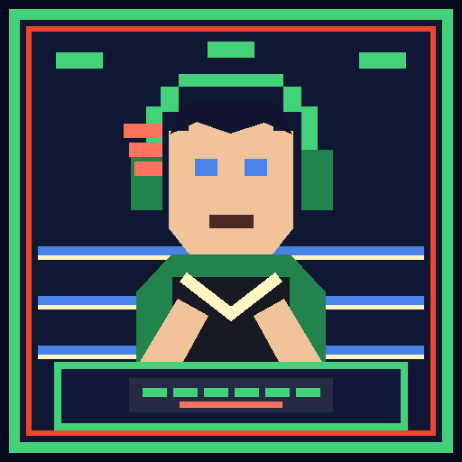
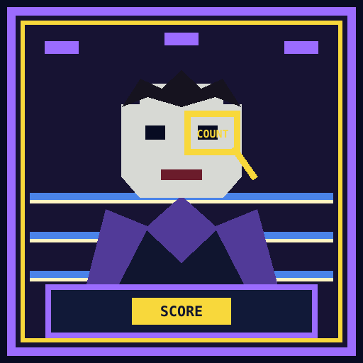
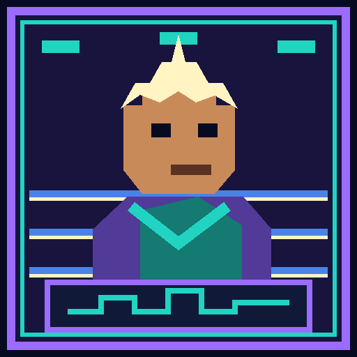

# Ringside

> **Bring the right voice to the proof.**

Ringside turns a database result into a conversation for the people in the room.
Choose who is ringside, name what they care about, and run the bout. The live
proof does not change by audience: the same task, verifier, timestamps, and
receipt remain authoritative. Ringside changes only the explanation and the
question that follows it.

## Explain to the Room

After a round reaches an outcome, choose **Explain to the room**. The briefing
shows:

- the selected person's portrait, role, and ringside nickname;
- the priorities chosen for the session;
- **What this means** for that role;
- **Question for the room** to connect the proof to the real environment; and
- **What we proved**, including the exact result and its material boundaries.

When supporting voices were selected, switch between their role tabs. The proof
line stays fixed while the meaning and question change.

## Corner Strategy

Choose one lead voice for the person who owns the decision or feels the pain most
directly. Add up to two supporting voices when the decision crosses boundaries.
Useful combinations include:

- Software Engineer + DBA for safe change and recovery;
- Data Engineer + Data Analyst for operational-data freshness;
- SRE + Application Owner for readiness and user impact; and
- Architect / IT + Infosec + Executive for standardization decisions.

The Executive is usually strongest as a supporting voice: it connects a
technical result to a deadline, beneficiary, and accountable owner without
turning seconds into unsupported dollars.

## Ringside Roster

These are working roles, not mascots. Each character gives the presenter a
recognizable point of view while keeping the conversation on evidence,
ownership, and the next useful question.

### Backfill Bill · Data Engineer

*“Another pipeline, just to move one value.”*

- **Builds / owns:** Pipelines, data movement, freshness checks, and replay.
- **Who depends on them:** Application teams, analysts, and ML workflows.
- **Cost lens:** Delayed jobs, duplicated pipelines, retries, and engineering time.
- **Performance lens:** Source-to-consumer freshness and downstream checkpoints.
- **Simplicity lens:** Handoffs, runbooks, copies, and restart ownership.
- **Best-fit rounds:** Round 4, lakehouse to app; Round 6, app to lakehouse.
- **Representative question:** “Which downstream freshness checkpoint follows the committed transaction?”

 

### Stacktrace Jack · Software Engineer

*“Needs a test database. Files a ticket. Waits.”*

- **Builds / owns:** Application code, database contracts, retries, and releases.
- **Who depends on them:** Product teams, users, support, and platform owners.
- **Cost lens:** Timeout failures, release delay, rework, and support hours.
- **Performance lens:** The exact transaction boundary and application timeouts.
- **Simplicity lens:** Custom start logic, test environments, pooling, and idempotency.
- **Best-fit rounds:** Round 1, wake; Round 2, safe change; Round 5, connections.
- **Representative question:** “What timeout does the application enforce while the database wakes?”

 

### Count Query · Data Analyst

*“Two dashboards, two numbers, one meeting.”*

- **Builds / owns:** Trusted metrics, analysis, reconciliation, and decision inputs.
- **Who depends on them:** Operational teams and business decision-makers.
- **Cost lens:** Stale decisions, reconciliation time, and missed deadlines.
- **Performance lens:** When a correct answer becomes too late to use.
- **Simplicity lens:** Copies, access handoffs, and metric ownership.
- **Best-fit rounds:** Round 4, score delivery; Round 6, live-order analytics.
- **Representative question:** “How fresh must this answer be before analysts stop reconciling copies?”

 

### Major Pattern · Architect / IT

*“Wrote the standard. Watched six teams route around it.”*

- **Builds / owns:** Platform standards, reference architectures, and exceptions.
- **Who depends on them:** Teams that must adopt and operate a repeatable path.
- **Cost lens:** Platform support, exceptions, and duplicated components.
- **Performance lens:** Service objectives that belong in the standard.
- **Simplicity lens:** Paved paths, ownership boundaries, and policy steps.
- **Best-fit rounds:** Round 2, safe change; Round 5, connection readiness.
- **Representative question:** “Which services qualify, and what policy excludes the rest?”

 

### Doctor Drift · Data Scientist / ML

*“The score is fine. Nothing is using it.”*

- **Builds / owns:** Models, features, scores, experiments, and serving workflows.
- **Who depends on them:** Applications and product decisions that consume model output.
- **Cost lens:** Recomputation, experiment delay, and unused model output.
- **Performance lens:** Feature or score freshness at the product boundary.
- **Simplicity lens:** Delivery ownership, notebooks, serving stores, and retries.
- **Best-fit rounds:** Round 4, put a governed score in the app.
- **Representative question:** “Which product decision sets the score-delivery deadline?”

 

### Lockjaw Lucy · DBA

*“Owns the restore nobody has rehearsed.”*

- **Builds / owns:** Database reliability, restores, retention, and operating controls.
- **Who depends on them:** Every application and user that relies on the database.
- **Cost lens:** Restore labor, retention, ready capacity, and database support.
- **Performance lens:** RTO, exact recovered reads, and verified readiness.
- **Simplicity lens:** Runbooks, promotion, rollback, cleanup, and integrity checks.
- **Best-fit rounds:** Round 1, wake; Round 3, recovery; Round 5, connections.
- **Representative question:** “What must the runbook verify before this table serves applications?”

 

### 3 A.M. Sam · SRE

*“Paged for a database that says it is fine.”*

- **Builds / owns:** Service objectives, alerts, mitigation, and incident closure.
- **Who depends on them:** Application owners, support teams, and users.
- **Cost lens:** Outage impact, on-call toil, and mitigation effort.
- **Performance lens:** The signal that actually closes recovery or readiness.
- **Simplicity lens:** Alert ownership, escalation, retries, and operational handoffs.
- **Best-fit rounds:** Round 1, wake; Round 3, recovery; Round 5, connections.
- **Representative question:** “Which alert tells on-call that order freshness missed its SLO?”

 

### The Big Why · Executive

*“Has heard ‘faster’ and wants ‘so what’.”*

- **Builds / owns:** Priorities, funding, deadlines, and accountable outcomes.
- **Who depends on them:** Customers, business teams, and delivery leaders.
- **Cost lens:** The consequence of delay, not an invented conversion from time.
- **Performance lens:** The business deadline behind the technical boundary.
- **Simplicity lens:** Team handoffs and clear accountability.
- **Best-fit rounds:** The round that proves the lead role's required outcome.
- **Representative question:** “What business deadline makes this result material?”

 

### Cipher Viper · Infosec

*“Signs off on things built before anyone asked.”*

- **Builds / owns:** Controls, trust boundaries, approvals, and evidence.
- **Who depends on them:** Teams that need an authorized and auditable path.
- **Cost lens:** Recurring review work and duplicated evidence.
- **Performance lens:** When access or control checks must finish.
- **Simplicity lens:** Identity, secrets, approvals, and evidence ownership.
- **Best-fit rounds:** Round 2, isolation; Round 3, recovery; Round 5, connections.
- **Representative question:** “Which approval is required before this score can serve the application?”

 

### Launch-Day Lola · Application Owner

*“Launch is Thursday. Checkout is the whole product.”*

- **Builds / owns:** The customer journey, launch readiness, support, and fallback.
- **Who depends on them:** Users, product teams, support, and operations.
- **Cost lens:** User loss, support load, and delayed launch.
- **Performance lens:** The user-facing deadline beyond the database step.
- **Simplicity lens:** Signoffs, fallback behavior, and readiness ownership.
- **Best-fit rounds:** Rounds 1–3 and Round 5.
- **Representative question:** “Which user action needs this answer before it goes stale?”

 

## Fight Card: Six Rounds

1. **Wake this idle app** — Best for Software Engineers, SREs, DBAs, and
   Application Owners discussing automatic wake, retries, readiness, and warm
   capacity.
2. **Make this schema change safely** — Best for Software Engineers, Architects,
   DBAs, and Infosec discussing isolation, compatibility, promotion, and rollback.
3. **Recover this deleted order** — Best for DBAs, SREs, Application Owners, and
   Infosec discussing exact recovery, RTO, integrity, and service resumption.
4. **Move lakehouse data into an app** — Best for Data Engineers, Data Scientists,
   Analysts, and Application Owners discussing governed score delivery and
   freshness.
5. **Get spike-ready** — Best for Software Engineers, SREs, DBAs, and Architects
   discussing connection readiness, pooling, credentials, and ownership.
6. **Move app data into the lakehouse** — Best for Data Engineers, Analysts, SREs,
   and Application Owners discussing order-to-answer freshness and checkout
   protection.

## Corner Priorities

Select one to three priorities before the bout:

- **Cost** asks what delay, labor, support, or standing capacity must be priced.
- **Simplicity** asks which steps, handoffs, tools, runbooks, and owners remain.
- **Performance** stays on the executed stop condition and the deadline it serves.

Combined selections use a complete reviewed explanation and question. They are
not stitched together from fragments. Changing priorities never changes the
measured proof.

## Proof Rules

Ringside follows the same evidence rules as the arena:

- a verified lane needs its exact stop condition and measurement;
- one-sided evidence names the verified lane and the lane that did not verify;
- a towel preserves verified measurements and reports unfinished work only as a
  lower bound;
- Rounds 4 and 6 make capability claims, not an unexecuted AWS speed comparison;
- Round 5 declares a result only after setup, spike, fairness, and cleanup gates
  pass; and
- missing evidence never inherits success language.

If a round is partial or fails, the briefing explains the failed gate and asks
what must pass next. If no lane verifies, it says there is no result. Dynamic
proof values must all be present; unresolved placeholders are never shown.

## Coach's Notes

Use the briefing in this order:

1. **Say who this is for.** “For the Software Engineer…”
2. **Read What this means.** Do not add a broader claim.
3. **Ask the room question and pause.** The answer supplies the customer-specific
   deadline, owner, or cost baseline the proof cannot invent.
4. **Show What we proved.** Point to the exact measured boundary and its caveat.
5. **Return to the ring.** Use Instant Replay or the receipt for deeper evidence.

For a mixed room, let the lead voice frame the decision and use supporting voices
to expose handoffs. The proof line should remain visibly identical as you switch.

## Content provenance and architecture

The audience copy is a reviewed static corpus: six rounds × ten personas × seven
non-empty priority selections. Separate reviewed outcome records cover verified,
one-sided, capability-gap, partial, towel, and no-result states. The frontend
loads those canonical JSONL sources into typed lookups and uses one
round-specific evidence classifier for meaning, question, and proof.

The public sources are
[`verified-corpus.jsonl`](frontend/src/ringside-cues/verified-corpus.jsonl) and
[`outcome-copy.jsonl`](frontend/src/ringside-cues/outcome-copy.jsonl). Source
presentation materials are not linked because they are not publication-safe;
the methodology and approved public copy are fully represented here and in the
repository.
