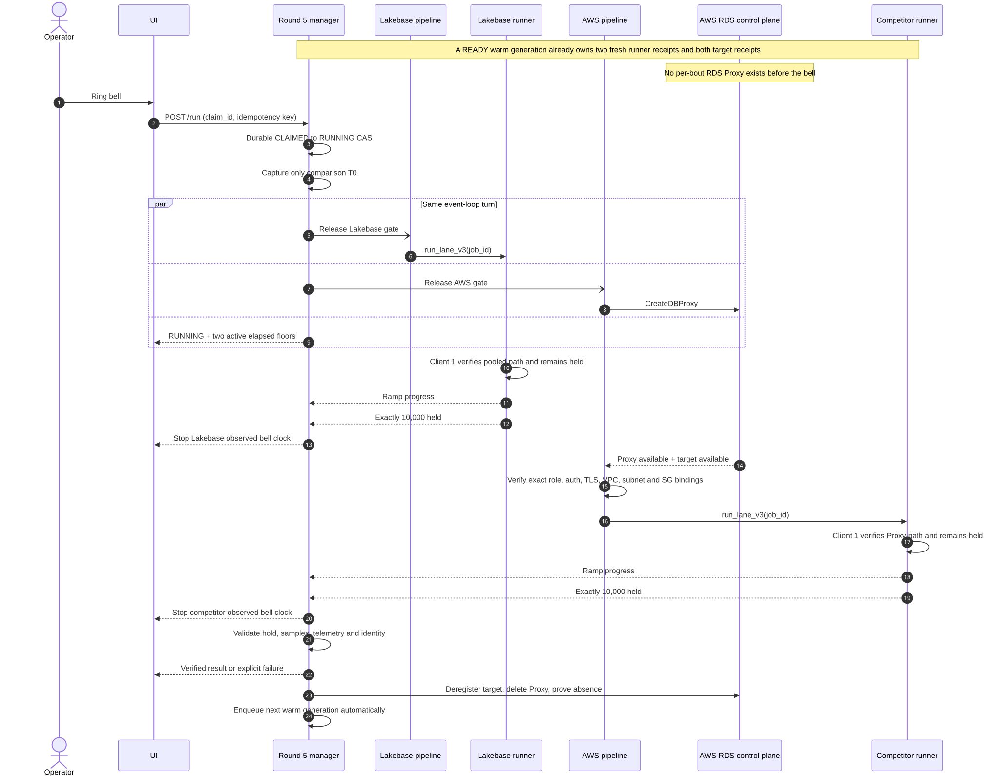

# Round 5: automatic warm, bell-to-10k execution design

Status: proposed implementation contract

Protocol: `round5-bell-to-10k-v4`

Supersedes the Round 5 launch, arm, barrier, and timer semantics in
`docs/ROUND5_10K_PROTOCOL.md`.

## Owner requirement

Round 5 has a backstage preparation loop, not a user-triggered hour-long ARM step:

```text
deploy/startup
  -> automatically warm Round 5, even if this takes about 3,600 seconds
  -> READY: the fight card is immediately ringable
  -> claim the ready generation in O(1)
  -> bell
  -> Lakebase starts toward 10,000 immediately
  -> AWS starts CreateDBProxy immediately
  -> AWS starts toward 10,000 immediately after the Proxy is usable
  -> cleanup
  -> automatically warm the next generation, even if this takes about 3,600 seconds
  -> READY again
```

No session creation, Round 5 selection, ARM click, or bell request is allowed to trigger the slow
warm operation. If a valid warm generation does not exist, Round 5 is visibly unavailable; the
system prepares it in the background and retries without an operator action.

The fresh per-bout RDS Proxy remains part of the measured race. **A warm generation must prove that
the Proxy is absent; it must never pre-create the Proxy.**

## Non-negotiable outcomes

1. One server-owned bell starts both large clocks and both independent lane pipelines.
2. Lakebase's first timed operation dispatches the command that opens its first retained client and
   then fans in to exactly 10,000 authenticated, simultaneously held clients.
3. AWS's first timed control-plane mutation is `CreateDBProxy`.
4. When the Proxy and selected target pass the exact control-plane gate, AWS dispatches its retained
   first client and 10,000-client fan-in immediately.
5. Neither lane waits for the other.
6. Both large UI clocks always mean **bell to observed exact 10,000 held**. They never freeze during
   setup and never switch to a different metric after a lane finishes.
7. Slow preparation is automatic on process startup/deploy and after every Round 5 cleanup. There is
   no after-bell fallback.

“Immediately” means that no intentional application barrier, preflight, credential mint, topology
reread, cost write, progress publication, or logging write lies between an eligibility edge and task
scheduling. Provider, network, SSM, TLS, authentication, and socket-ramp latency still occur and stay
visible in the bell-relative clock.

## Normal lifecycle



Editable source: `docs/round5-warm-lifecycle.mmd`

PNG export: `docs/round5-warm-lifecycle.png`

The durable normal loop is:

```text
WARMING -> READY -> CLAIMED -> RUNNING -> CLEANING -> WARMING
```

- `WARMING`: one fenced coordinator is preparing a new installation generation. Retriable failures
  stay here with an explicit retry time and safe error code.
- `READY`: both physical runners, Lakebase, Aurora, RDS, credentials, static network fixtures, and
  exact Proxy absence have fresh receipts. No bout owns the slot.
- `CLAIMED`: one session has atomically bound the generation, selected competitor, runner pair, and
  fence. This transition is a durable compare-and-swap, not preparation.
- `RUNNING`: the authoritative bell was accepted and the two lane gates were released.
- `CLEANING`: new dispatch is fenced; commands, target registration, Proxy, and per-bout resources are
  being settled in dependency order.
- `BLOCKED`: a non-retriable configuration, ownership, security, or capacity defect needs operator
  correction. A successful reconciliation moves it to `WARMING`; it never bypasses preparation.

If a `READY` generation loses required freshness, leadership, runner boot identity, or credential
margin, it atomically returns to `WARMING` before the fight card can offer Round 5. If a claim expires
without a bell, it returns to `READY` only when every receipt and launch capsule still validates;
otherwise it returns to `WARMING`.

## Architecture decisions

- Keep one installation-scoped `Round5WarmSlot`, durably fenced through the Round 5 coordination
  store. Do not put the slow preparation inside a session record.
- Warm Aurora and provisioned RDS variants before advertising `READY`. They share runner receipts but
  have separate source, secret, security-group, role, target, and Proxy-absence receipts.
- Turn the existing `/arm` operation into an idempotent compatibility claim. It may bind an already
  ready generation; it may never execute AWS discovery, SSM capacity measurement, or other warm work.
- Use two **physical** sealed `c7i.2xlarge` runner instances: one Lakebase runner and one competitor
  runner. Each has its own adapter, capacity model, job registry, lock, command state, progress cursor,
  and cancellation owner.
- Install static, least-privilege, installation-owned Proxy network fixtures for each competitor
  variant. This makes `CreateDBProxy` the first post-bell AWS mutation without temporarily allowing
  broad/default egress. The per-bout Proxy itself is never a static fixture.
- Use one authoritative server comparison origin. Runners may use their own monotonic clocks for
  lane-local ramp duration, but clocks from different machines are never numerically compared.
- The first retained client in each lane performs the pooled-path transaction and stays in that lane's
  10,000-client set. Do not run a separate verification command before fan-in.
- A fatal lane failure automatically stops the sibling lane and outstanding Proxy work, then enters
  cleanup. Exact one-lane evidence may be retained, but no winner is declared.

## Durable and ephemeral contracts

### `Round5WarmSlot` — durable, installation-scoped, secret-free

```text
Round5WarmSlot
  protocol = round5-bell-to-10k-v4
  installation_id
  slot_ordinal
  generation
  state = WARMING | READY | CLAIMED | RUNNING | CLEANING | BLOCKED
  revision
  coordinator_fence
  process_epoch
  broker_epoch
  warm_contract_sha256
  warming_started_at
  ready_at | null
  ready_expires_at | null
  renew_by | null
  shared_receipt
    source/config/runner-image/fanin-contract/capacity-model digests
    lakebase_runner_capacity_receipt
    competitor_runner_capacity_receipt
    runner instance ids, boot ids, shapes, and receipt expirations
    Lakebase pooled/direct bindings and trust digests
    static network-fixture digest
  variants[aurora|rds]
    state
    target/source/secret-ref/role/auth/TLS/SG/subnet/VPC digests
    exact Proxy-absence receipt and observed_at
    prepared request-template digest
    expires_at
  claim | null
    claim_id, session_id, bout_id, selected_variant, bout_fence
    claimed_at, claim_expires_at
  last_attempt_at | null
  attempt_count
  next_retry_at | null
  last_error_code | null
  last_error_at | null
```

No hostname, password, OAuth token, STS credential, raw ARN collection, or provider exception belongs
in this record or in its public projection.

Persist an append-only `Round5WarmEvent` beside the mutable head, with a unique idempotency key,
generation/slot, process/broker epochs, claim/bout fences where applicable, event type, from/to state,
timestamp, and bounded safe detail. Updating the head and appending its event happen in one database
transaction. Do not reuse the existing per-bout creation journal: its non-deleted rows intentionally
mean abandoned provider work that startup must remove.

### `Round5LaunchCapsule` — ephemeral and continuously renewed

The elected warm coordinator materializes an in-memory capsule for the current generation:

```text
Round5LaunchCapsule
  generation + coordinator_fence
  immutable one-lane request for each physical runner
  prepared AWS control-plane client context
  prepared SSM dispatch context per runner
  Lakebase endpoint/auth material
  Aurora and RDS target-specific launch contexts
  credential_generation
  expires_at + renew_by
```

Raw credentials are never persisted in `Round5WarmSlot`. A background refresher obtains a replacement
capsule and atomically swaps it in while the old one remains usable. `READY` requires enough remaining
credential lifetime for the 30-minute Proxy setup deadline plus dispatch and clock-skew margin. Refresh
begins before that threshold; a refresh failure removes ring readiness before the margin is lost.

Use separate freshness gates for control-plane and dispatch credentials: the AWS setup context must
cover the full 30-minute setup bound plus margin, and each SSM dispatch context must cover the full
660-second runner bound plus pre/postflight margin. The current 900-second burst session cannot be
accepted with only 150 seconds left.

Cleanup assumes fresh credentials under the durable cleanup fence. It never relies on the credential
set captured for launch and therefore is not constrained by a one-hour STS lifetime.

### `Round5BoutClaim` — O(1) binding

Creating/selecting a Round 5 session performs one fenced database transaction that acquires the main
ring/round-specific claim and compare-and-swaps `READY` to `CLAIMED`. The claim binds the selected
Aurora/RDS receipt, both runner slots, capsule generation, deterministic job ids, and bout fence. It
contains no provider work and should be indistinguishable from an ordinary coordination-store write in
latency. A partial ring/slot claim is never externally visible.

The Round 5 card is disabled while the slot is not `READY`. A claim may be renewed backstage for an
active operator; expiration never launches slow preparation in the request path.

### `BellContext` — one comparison origin

```text
BellContext
  bell_id
  claim_id
  warm_generation
  bout_id
  bout_fence
  bell_at_utc
  t0_monotonic_ns       # private to the server process
```

The API exposes `bell_id`, UTC display time, revision, and server-computed elapsed floors. It does not
send `t0_monotonic_ns` to the browser.

## Automatic warm coordinator

### Deploy/startup

The application must remain live while a one-hour warm runs. Therefore process startup starts the
coordinator as a supervised background task; it does not hold the platform liveness endpoint open for
3,600 seconds.

Startup order is strict:

1. Open the main, Round 5, receipt, and cost coordination stores.
2. Acquire or observe the durable Round 5 coordinator lease.
3. Reconcile any inherited `RUNNING`/`CLEANING` claim, runner job, target registration, Proxy, journal,
   or cleanup debt. Cleanup always wins over warming.
4. Run the existing installation orphan sweep and prove exact ownership/absence.
5. Durably create or resume generation `N` in `WARMING`.
6. In parallel where independent:
   - verify both runner identities/images and run one-lane capacity preflight on each;
   - prepare Lakebase endpoint, role, trust, and request evidence;
   - prepare Aurora and RDS source/secret/role/TLS/network evidence;
   - verify static Proxy network fixtures;
   - verify that no per-bout Proxy or mutable Round 5 journal debt exists;
   - materialize and begin rotating launch capsules;
   - pre-stage the deterministic cost identity without opening a measured window.
7. Commit `READY` only if all shared and both variant receipts match the current generation/fence and
   meet their freshness margins.

The current `app.py` runtime startup is the integration point. Construct the store/coordinator after
coordination initialization and inject it into `RunManager`; start its supervised task only after the
existing readiness/orphan machinery reports a safe Round 5 baseline. Retain its task/store in
`_Runtime`, then cancel and await it before closing coordination during `_close_runtime()`.

Provision the new coordination table and runtime grants through the repository's lifecycle/bootstrap
schema-owner path before deploying code that requires it. The deployed app principal must not attempt
DDL. Use a dedicated warm-slot fence rather than the ordinary bout ring generation, because an ordinary
bout must not invalidate the installation's preparation record.

Any stable warm-owned fixture uses installation/slot ownership tags and is explicitly distinguishable
from the per-bout journal. The startup orphan reaper must never delete or refuse a valid static warm
fixture as though it were an abandoned bout. Conversely, per-bout resources are never adopted into the
warm slot.

On process or coordinator-leader replacement, a durable `READY` record is not sufficient by itself.
The new owner first changes it to `WARMING`, rehydrates fresh ephemeral capsules, validates boot ids and
receipt freshness, and only then republishes `READY`. This is automatic and may reuse still-valid
secret-free receipts; it never trusts credentials from a dead process.

The adoption hash covers only the Round 5 warm contract and relevant infrastructure identities, not
the entire manifest. An unrelated reseal must not destroy an otherwise valid hour-long warm. Rapid
duplicate startup is harmless: every step rereads and compare-and-swaps durable state instead of
unconditionally creating work.

### Retriable and blocked warm failures

Retriable throttling, 5xx, transport timeouts, and transitional provider states stay `WARMING` with
capped exponential full-jitter retries. Auth, ownership, digest, least-privilege, wrong-account,
wrong-region, or insufficient-capacity defects become `BLOCKED`. Public status contains a safe error
code and next retry time, never a secret or raw provider message.

No retry loop is tied to an HTTP request or an open browser.

### Re-warm after cleanup

Entering `CLEANING` records that replenishment is required, but generation `N+1` does not begin while
current bout ownership still exists. This keeps cleanup and warm authority unambiguous.

After target deregistration/reset, Proxy delete acceptance, reverse dependency cleanup, and exact
absence proof, the cleanup transaction:

1. closes the bout claim;
2. advances the durable generation to `N+1`;
3. sets `state=WARMING` and `warming_started_at`;
4. releases the old cleanup fence; and
5. wakes the background coordinator.

That exact cleanup commit is the canonical and only `CLEANING -> WARMING(N+1)` edge. A credential
broker may refresh generic credentials during cleanup, but it may not publish receipts or perform work
on behalf of generation `N+1` before this transaction commits.

This transition is automatic on verified completion, towel, failure, and restart reconciliation. It
does not wait for an operator to create a session or press ARM.

## Bell transaction

The authoritative bell is the successful durable transaction that moves the main and Round 5 leases
plus the warm slot from `CLAIMED` to `RUNNING`. HTTP request arrival is recorded separately as latency
diagnostics; it is not a second clock. Failure of any row update rolls the entire transition back.

Before that compare-and-swap, the manager constructs the two lane tasks behind a closed in-process
start gate. After the durable commit succeeds, one event-loop turn performs:

1. capture the only server `t0` and `bell_at_utc`;
2. install the immutable `BellContext` and mark both public clocks active;
3. release the gate shared by the Lakebase and AWS tasks;
4. schedule event publication; and
5. return a `RUNNING` snapshot.

No provider call, credential refresh, cost-ledger creation, event publication, or log write is awaited
between T0 and releasing the gate. The cost record is pre-staged while warming/claiming and activated
idempotently by `bell_id` off the dispatch path.

`POST /run` never returns the old `ARMED`/`CLAIMED` snapshot. A duplicate request returns the same
`bell_id`, clock, pipeline tasks, cost identity, Proxy identity, and runner job ids.

The browser starts both visible timers on the first `RUNNING` response/event, using the server's
already-advanced elapsed floor, so network latency cannot produce a frozen `0.00`. The visible bell
affordance and audio should be aligned to this accepted transition; the comparison clock remains
server-authoritative.



Editable source: `docs/round5-bell-to-10k.mmd`

PNG export: `docs/round5-bell-to-10k.png`

## Timed lane pipelines

### Lakebase

The first awaited external operation after gate release is dispatch of deterministic
`run_lane_v3(job_id, prepared_request_digest)` to the dedicated Lakebase runner.

Under one runner-local timeline, the command:

1. atomically owns or rejoins `job_id` in the runner's durable job registry;
2. performs only O(1) boot-id, receipt-expiry, FD/memory safety, digest, and trust checks;
3. opens client 1 through the included pooled endpoint, authenticates, executes the readiness
   transaction, and retains that connection;
4. opens clients 2 through 10,000;
5. proves exactly 10,000 authenticated and simultaneously held clients;
6. holds for at least 30 seconds, completes 64/64 sparse samples and direct-observer multiplexing,
   telemetry, identity, and settlement gates.

It must not repeat the selector/CPU capacity benchmark, discover the host, assume an AWS role, perform
a separate SSM verification transaction, or wait for the AWS lane.

### AWS competitor

Gate release starts the selected Aurora/RDS control-plane pipeline. Because static sealed network
fixtures already exist, its first mutation is `CreateDBProxy` using the deterministic bout identity.

The dispatch gate is exact and safety-critical:

- expected Proxy identity and endpoint are `available`;
- the default target group exists with the sealed pool settings;
- exactly the selected Aurora cluster or RDS instance is registered and `available`;
- engine family, role, secret/auth scheme, TLS policy, VPC, subnets, Proxy security group, database
  source group, and runner source group match the claimed variant receipt;
- the journal and coordinator fence still own every mutable resource.

As soon as this control-plane gate passes, dispatch `run_lane_v3` to the dedicated competitor runner.
Its client 1 performs the real transaction through the Proxy and remains client 1 of the 10,000 set;
there is no standalone SSM transaction command. The Aurora pending-capacity wake path may operate while
the Proxy is provisioning but may not add work after the dispatch gate.

Only non-safety evidence serialization may finish asynchronously after dispatch. Any check that could
change whether the endpoint is the intended secure pooled path belongs in the gate.

### Physical independence

The normative topology is two distinct sealed `c7i.2xlarge` instances. Each runner is evaluated with a
v3 **one-lane** capacity model; the current receipt that projects both lanes onto one machine is not
reused. Infrastructure and standing-cost disclosures include both instances.

Each lane owns its own adapter, lock, pending/active ids, deterministic job registry, progress stream,
task, cancellation state, and settlement deadline. The bout supervisor observes tasks as they finish;
it never awaits Lakebase first and discovers an AWS failure minutes later.

### Idempotent runner jobs

AWS SSM `SendCommand` has no client token. Stable command text alone cannot prevent duplicates after an
ambiguous acknowledgement. Each physical runner therefore needs a persistent, atomic job registry,
keyed by:

```text
job_id = hash(protocol + warm_generation + bell_id + lane_id)
```

The SSM entry point claims `job_id` with an atomic create/transaction before opening a socket. A second
invocation with the same job id attaches to or returns the existing job; it cannot start another fan-in.
Results and sequenced progress remain queryable by job id after the invoking SSM command exits. After
an ambiguous send, the manager queries the registry and may safely resend the same job id. Cleanup
cancels and settles the job id, not just the last observed SSM command id.

## Public state, clocks, and measurement

Add a versioned projection rather than overloading setup lanes:

```text
Round5RuntimeSnapshot
  protocol = round5-bell-to-10k-v4
  warm_generation
  bell_id
  revision
  state
  bell_at_utc
  lanes[lakebase|competitor]
    phase
    elapsed_at_snapshot_ms
    bell_to_10000_observed_ms | null
    observation_uncertainty_ms | null
    pooled_path_ready_observed_ms | null
    ramp_started_observed_ms | null
    ramp_time_to_10000_ms | null
    clients_initiated
    clients_authenticated
    held_clients
    sampled_queries_succeeded
    status
```

Normal phases are:

| Lane | Phase order |
| --- | --- |
| Lakebase | `dispatching` -> `verifying_path` -> `ramping` -> `holding` -> `verified` |
| AWS | `provisioning_proxy` -> `verifying_proxy` -> `dispatching` -> `verifying_path` -> `ramping` -> `holding` -> `verified` |

For every active lane, the server computes `elapsed_at_snapshot_ms` from its private bell origin even
before the first provider callback. The browser seeds from that floor and interpolates with
`performance.now()`. On reload/reconnect it accepts only a newer revision and never rewinds.

The exactness claim applies to the 10,000-client gate, not to cross-machine clock arithmetic. The large
clock stops at `bell_to_10000_observed_ms`, the manager's upper-bound observation of the sequenced exact
gate. Record the preceding/following poll or delivery bounds as `observation_uncertainty_ms`. Runner
monotonic time supplies the precise lane-local `ramp_time_to_10000_ms`; it is a supporting metric, not
the comparison clock.

## Readiness and fight-card contract

General application liveness and other rounds remain available during a long warm. `/readyz` adds:

```text
round5_warm_state
round5_warm_generation
round5_warm_revision
round5_warm_started_at
round5_warm_ready_at
round5_warm_renew_by
round5_ring_ready
round5_warm_variants.aurora.state/expires_at
round5_warm_variants.rds.state/expires_at
round5_warm_runners.lakebase.state/boot_id/expires_at
round5_warm_runners.competitor.state/boot_id/expires_at
round5_warm_attempt_count
round5_warm_last_attempt_at
round5_warm_next_retry_at
round5_warm_last_error_code
round5_claim_id
round5_claim_expires_at
round5_cleanup_owed
```

`round5_ring_ready=true` requires `state=READY`, both variants fresh, both runners fresh, a current
launch capsule, exact Proxy absence, and no cleanup debt. The fight card hides or disables Round 5
until that Boolean is true and shows “Preparing backstage” plus safe progress/retry status. It must not
offer a button that starts warming.

The deployment verifier currently allows only 300 seconds for all six rounds. Change it to wait for
the explicit Round 5 `READY` generation for a configurable warm deadline longer than the measured
3,600-second worst case (recommended default: 4,500 seconds). `/healthz` and the platform startup stay
fast; `bootstrap.sh --deploy-only` simply does not print “READY TO RING” or record deployment success
until automatic warming finishes. A warm failure prints the safe warm status and retry/block reason.

## Progress and observability

Wire the existing runner-progress parser into every lane. Persist state first, notify SSE second, and
keep all event/log I/O off scheduling edges. A dedicated sanitized timeline records:

```text
warm_started / warm_step / warm_ready / warm_retry / warm_blocked
warm_capsule_refreshed / warm_freshness_lost
claim_created / claim_released
bell_request_received / bell_accepted / lane_gate_released
proxy_create_requested / proxy_create_accepted
proxy_control_gate_passed
lane_job_requested / ssm_command_accepted / lane_first_client
lane_progress / lane_10000_held / lane_hold_verified / lane_result
cleanup_started / target_deregistered / proxy_delete_accepted
cleanup_absence_verified / rewarm_enqueued
```

Every entry includes only installation/session/bell/generation/lane identifiers, safe event code,
revision, bell-relative elapsed where applicable, and outcome. Never log hosts, credentials, tokens,
passwords, secret values, unredacted ARNs, or raw provider exceptions. Give this timeline a dedicated
handler or event stream; the current operator logger filters `INFO` records below its `WARNING`
threshold.

Required scheduling SLOs, measured server-side:

- one accepted `bell_id` and one comparison origin per bout;
- both lane gates released in the same event-loop turn and within 10 ms of each other;
- Lakebase job dispatch requested within 100 ms of bell acceptance;
- `CreateDBProxy` requested within 100 ms of bell acceptance;
- competitor job dispatch requested within 100 ms of the exact Proxy control gate;
- `/run` awaits no lane/provider work and returns the `RUNNING` snapshot immediately after scheduling;
- both browser clocks move on the first animation frame after accepting that snapshot;
- no timer rewind across progress, reload, reconnect, or terminal evidence.

## AWS retry and cleanup contract

Derive stable resource names and ownership tags from installation, warm generation, and `bell_id`.
Creation uses `ensure_resource`: after an ambiguous timeout, inspect the deterministic identity and
ownership, adopt the exact owned resource, or retry only after proving absence. Tolerate documented
eventual consistency with bounded describe retries.

Retry only throttling, transient 5xx, transport timeout, and documented transitional states with capped
full jitter. Auth, validation, ownership, fence, and digest failures are terminal. Configure SDK
connect/read timeouts so a thread cannot outlive all cancellation bounds. Keep the 30-minute Proxy
setup deadline and a realistic 40-45 minute absence-verification window under the cleanup lease.

All terminal paths use this order:

1. fence new dispatch;
2. cancel and settle both runner job ids within a bound;
3. deregister the Proxy target and restore/delete the per-bout target-group configuration;
4. request Proxy deletion and record AWS acceptance;
5. reverse per-bout network/journal resources in dependency order;
6. prove exact absence and reconcile ambiguous journal entries;
7. clear cleanup debt, close the claim, and atomically enqueue the next warm generation.

If runner settlement exceeds its bound, record the orphan and continue requesting Proxy deletion so a
billing resource is not retained indefinitely. The Round 5 cleanup fence remains held until exact
absence/reconciliation, even if the main ring can be safely released after delete acceptance.

Static installation-owned Proxy security groups are baseline fixtures and are never deleted per bout.

## Implementation map

| Area | Required change |
| --- | --- |
| `app.py` | Construct/supervise `Round5WarmCoordinator` after startup cleanup; cancel/settle it with runtime shutdown; project warm readiness. |
| `server/coordination.py` or new `server/round5_warm.py` | Dedicated durable slot table/fence, state transitions, retry loop, capsule renewal, restart reconciliation, safe fixture ownership. |
| `server/manager.py` | Replace slow per-session arm with O(1) claim; pre-stage cost identity; precreate gated lane tasks; one bell acceptance/T0; automatic cleanup-to-rewarm handoff. |
| `server/models.py` | Warm/readiness and V4 runtime projections; immutable bell/clock identity; permit one terminal lane while session is still resolving. |
| `server/connection_spike_live.py` | Split physical adapters; consume claimed contexts; remove preparation/fallback paths; exact Proxy gate; runner-job protocol; progress; owned cancellation. |
| `server/connection_fanin.py` | One-lane v3 capacity receipts and bell-relative observed results while retaining exact-count, hold, sample, telemetry, and identity gates. |
| `runner/connection_spike_runner.py` | Persistent idempotent `job_id` registry; fused retained-client `run_lane_v3`; lane-scoped cancellation/status/progress. |
| `runner/round5_fanin.py` | Preserve calibrated socket engine; expose sequenced retained-client/ramp/hold milestones without rerunning the expensive warm preflight. |
| `infra/aws` | Provision two sealed runners and static least-privilege Proxy network fixtures for Aurora and RDS; disclose both runners' standing cost. |
| `server/lifecycle.py` / bootstrap grants | Idempotently migrate the warm-slot table as schema owner and grant only required runtime access before app deploy. |
| `bootstrap.sh` | Keep the liveness probe short, then wait up to the configured warm SLA for `round5_ring_ready=true` before declaring READY TO RING. |
| `frontend/src/App.tsx` | Disable Round 5 until warm-ready; no slow ARM control; invariant bell clocks from first RUNNING snapshot; phase/count/retry display. |
| API types / `frontend/src/round5.ts` | Decode warm and V4 runtime fields; revision-safe timer re-anchoring; treat older receipts as legacy evidence only. |
| `docs/ROUND5_10K_PROTOCOL.md` | Replace the stale shared-ramp/barrier and manual-arm language before deployment. |

## Delivery order

1. **Warm coordinator and contracts:** durable state machine, startup trigger, both target receipts,
   capsule rotation, O(1) claim, `/readyz`, and cleanup-to-rewarm. Prove with fake providers and a
   deliberately 3,600-second simulated warm.
2. **Bell and UI clock:** gated tasks, durable bell transition, one comparison origin, immediate
   RUNNING projection, always-active browser clocks, and structured timeline.
3. **Physical runner isolation:** second runner, one-lane capacity model, durable idempotent jobs,
   fused retained client, real-time progress, cancellation/settlement.
4. **AWS critical path:** static fixtures, first-call `CreateDBProxy`, deterministic recovery, exact
   control gate, immediate competitor dispatch, bounded SDK calls.
5. **Failure and cleanup:** duplicate/ambiguous calls, lane failure, towel, lease loss, process restart,
   reverse-order teardown, exact absence, and automatic generation increment.
6. **Deployed acceptance:** one Aurora and one RDS bout, then the repository's required consecutive
   rehearsal campaign with a sanitized timeline for every run.

Do not spend a live Proxy bout to discover a branch that deterministic tests can exercise.

## Go/no-go acceptance

### Automatic warm

- A cold deploy/start starts `WARMING` without any session or HTTP mutation request.
- The app and other rounds stay available; Round 5 stays non-ringable during the entire simulated
  3,600-second warm.
- Completion publishes one `READY` generation with fresh Lakebase, Aurora, RDS, and two-runner receipts
  and a fresh launch capsule; no RDS Proxy exists.
- Claiming a generation performs no AWS, Databricks, SSM, capacity, or hostname-discovery call.
- Credential rotation replaces the capsule without losing readiness; forced refresh failure removes
  readiness before the safety margin expires.
- Restart in every state reconciles cleanup first and never trusts dead-process credentials.
- Exact cleanup automatically creates generation `N+1` in `WARMING`; no ARM click or new session is
  needed. The next 3,600-second simulated warm returns it to `READY`.
- Retryable failure exposes attempt/next-retry fields and recovers unattended; a terminal configuration
  defect exposes `BLOCKED` and never advertises ring readiness.

### Bell and lanes

- `/run` returns `state=RUNNING`, one `bell_id`, and two already-active clocks; it never returns the
  claimed snapshot.
- A running snapshot with no provider progress still advances both clocks; reload does not reset them.
- Lakebase dispatch precedes Proxy readiness and meets the bell scheduling SLO.
- `CreateDBProxy` is the first timed AWS mutation and meets the bell scheduling SLO.
- Competitor dispatch meets the Proxy-gate scheduling SLO and never occurs before every safety-critical
  gate passes.
- Both physical commands run concurrently without a shared adapter lock, runner flock, CPU allocation,
  active-id, or cancellation collision.
- Duplicate `/run`, callbacks, process retries, and ambiguous SSM acknowledgements produce one cost
  window, one Proxy, and one logical runner job per lane.

### Proof and recovery

- Exactly 10,000 retained authenticated clients passes; 9,999, any disconnect, telemetry failure, hold
  under 30 seconds, or fewer than 64/64 samples fails and suppresses the verdict.
- A one-sided exact result may be displayed but never declares a winner; its sibling work is stopped.
- Failure/towel/restart at every phase settles or durably records both runner jobs, deletes the Proxy,
  proves absence, clears cleanup debt, and automatically returns to `WARMING`.
- Sanitized deployed timelines prove ordering and freshness. Screenshots alone are not acceptance
  evidence.

## Current-system evidence

The deployed app was inspected read-only on 2026-09-15. It was healthy, Round 5 was ready, no phase was
active, and `round5_cleanup_owed=false`; relevant deployed files matched local commit `280c14c`. Safe
requests took roughly 0.5-1.1 seconds, so the observed 45-59 second frozen period is architectural, not
general Databricks Apps latency.

The current implementation violates this design in known ways:

- slow preparation is session/bout-bound and arm failure is tolerated;
- `/run` waits for lease and cost work, then returns the old armed snapshot;
- manager, setup, and UI use different effective clock edges;
- setup repeats STS and can repeat baseline discovery before its later T0;
- Lakebase runs host lookup plus a standalone SSM transaction before creating fan-in;
- each burst repeats STS/topology preflight before `SendCommand`;
- both nominal lane tasks share one adapter lock, scalar active id, physical runner, and runner flock;
- pending setup lanes intentionally render as frozen `0.00` clocks;
- runner progress parsing is implemented but unused;
- critical timing records are logged at `INFO` while the operator handler filters below `WARNING`.

These paths must be removed, not retained as compatibility fallbacks. Missing or stale warm evidence
blocks the bell and lets the automatic coordinator repair readiness backstage.
